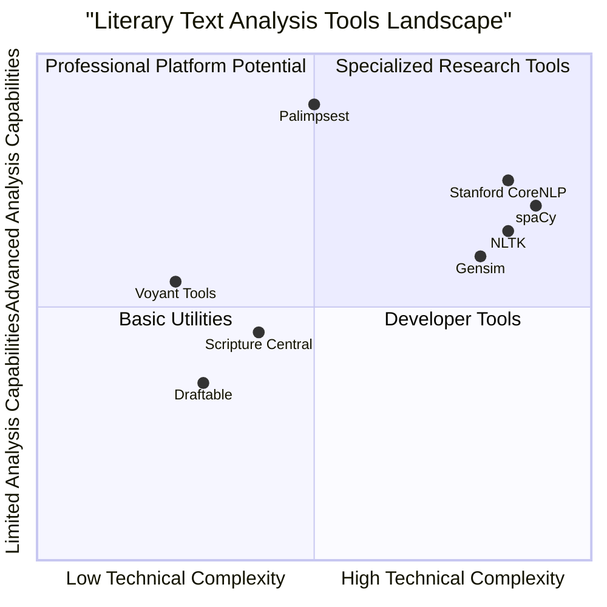

# Product Requirements Document: Palimpsest

## Language & Project Info

- **Language**: English
- **Programming Language**: React, JavaScript, and Tailwind CSS for frontend; Python for backend processing
- **Project Name**: palimpsest
- **Original Requirements**: Create a software tool (Palimpsest) that can compare very long text documents with each other (for example: The Bible and The Book of Mormon) or with themselves (for example: The Federalist Papers) to look for patterns of similarities and differences in multiple conceptual dimensions. The tool will perform global-level analyses for comparing up to four "large" documents, run statistical tests of comparison, and present interactive visuals for textual exploration.

## Product Definition

### Product Goals

1. **Enable Advanced Multi-Dimensional Text Comparison**: Create a platform that allows researchers, academics, and literary professionals to analyze and visualize similarities and differences between large texts across multiple dimensions (lexical, semantic, syntactic, structural).

2. **Democratize Computational Literary Analysis**: Make sophisticated text analysis techniques accessible to users without advanced technical skills through intuitive interfaces and visualizations.

3. **Facilitate New Insights in Comparative Literature**: Provide analytical capabilities that reveal previously undetected patterns, influences, and relationships between texts to advance literary scholarship and understanding.

### User Stories

1. **As a** religious scholar, **I want to** compare synoptic gospels across multiple dimensions **so that** I can identify unique authorship patterns and shared source materials.

2. **As a** literary researcher, **I want to** analyze structural and thematic similarities between epic literary works **so that** I can trace influences and evolutions across literary traditions.

3. **As a** linguistics professor, **I want to** perform syntactic pattern analysis across multiple translated versions of classical texts **so that** I can demonstrate how translation affects meaning and structure.

4. **As a** digital humanities student, **I want to** create interactive visualizations of textual relationships **so that** I can effectively present my research findings in an engaging manner.

5. **As a** content analyst, **I want to** compare different editions of historically significant documents **so that** I can track how ideas and language evolved over multiple revisions.

### Competitive Analysis

#### 1. Voyant Tools
- **Pros**: Free, web-based with various visualization options; good for basic text analysis; accessible to non-technical users
- **Cons**: Limited in processing very large texts; lacks advanced semantic analysis; minimal customization options; no dedicated document comparison features

#### 2. NLTK (Natural Language Toolkit)
- **Pros**: Comprehensive Python library; extensive educational resources; powerful text processing capabilities
- **Cons**: Requires programming knowledge; no built-in visualizations; steep learning curve; not designed specifically for literary document comparison

#### 3. spaCy
- **Pros**: Industrial-strength NLP capabilities; supports 75+ languages; excellent processing speed
- **Cons**: Requires technical expertise; no dedicated comparison interface; primarily a programming library rather than end-user tool

#### 4. Gensim
- **Pros**: Excellent for topic modeling and document similarity; handles large text datasets efficiently
- **Cons**: Limited to semantic dimensions; requires programming knowledge; lacks integrated visualization tools

#### 5. Draftable
- **Pros**: Excellent document comparison interface; highlights formatting differences; user-friendly
- **Cons**: Limited to textual differences; lacks semantic or structural analysis; primarily designed for legal/business documents

#### 6. Stanford CoreNLP
- **Pros**: Robust linguistic analysis tools; comprehensive language processing pipeline
- **Cons**: Primarily research-focused; complex setup; limited visualization capabilities

#### 7. Scripture Central/Gospel Parallels
- **Pros**: Domain-specific for religious text comparison; good visualization of textual relationships
- **Cons**: Limited to specific religious texts; lacks generalized analysis capabilities; minimal customization

### Competitive Quadrant Chart



## Technical Specifications

### Requirements Analysis

Palimpsest aims to fill a significant gap in the current market by providing a comprehensive, user-friendly platform for multi-dimensional text analysis that doesn't require advanced technical knowledge. While existing tools offer various aspects of text analysis (NLP libraries provide powerful algorithms, document comparison tools offer clean interfaces), none combine advanced analysis with intuitive visualization specifically designed for literary and academic research.

The solution requires:

1. A robust backend system capable of processing and analyzing very large texts efficiently
2. Integration with various NLP models and techniques for different levels of analysis
3. LLM integration for advanced analysis capabilities
4. An intuitive, interactive frontend for visualization and exploration of results
5. Cross-platform compatibility to serve diverse user needs
6. Scalable architecture to handle multiple large documents simultaneously

### Requirements Pool

#### P0 (Must-Have)

1. **Document Input and Management**
   - Must support upload of user's own text documents in common formats (TXT, PDF, DOCX)
   - Must integrate with public text repositories (Project Gutenberg, etc.)
   - Must handle documents of at least 1 million words
   - Must support comparison of up to 4 large documents simultaneously

2. **Core Analysis Capabilities**
   - Must include semi-fuzzy string matching for identifying shared phrases
   - Must include basic semantic matching for identifying shared ideas/concepts
   - Must support syntactic analysis for comparing grammatical structures
   - Must include theme/topic/sentiment analysis across texts

3. **User Interface**
   - Must provide an intuitive dashboard for selecting texts and analyses
   - Must include interactive visualizations for exploring results
   - Must allow saving and exporting of analysis results
   - Must support basic text selection and subsection definition

4. **Performance**
   - Must leverage multi-threading for efficient processing
   - Must process 1M word document analysis within reasonable time constraints (<30 minutes)
   - Must support incremental analysis to allow partial results viewing

5. **Cross-Platform Support**
   - Must function on Windows and MacOS operating systems
   - Must offer web browser "lite" version with core functionality

#### P1 (Should-Have)

1. **Advanced Analysis Features**
   - Should include complex semantic matching using advanced NLP models
   - Should support structural analysis for comparing organization and flow
   - Should provide plot analysis for narrative texts
   - Should include LLM-aided research plan generation

2. **Enhanced User Interface**
   - Should support side-by-side text viewing with highlighted relationships
   - Should provide customizable visualization settings
   - Should include annotation and note-taking capabilities
   - Should support user profiles and project saving

3. **Performance Enhancements**
   - Should implement caching for faster repeated analyses
   - Should optimize visualization rendering for large datasets
   - Should support background processing of intensive analyses

4. **Extended Platform Support**
   - Should support Linux operating system
   - Should offer responsive design for various screen sizes

#### P2 (Nice-to-Have)

1. **Advanced Features**
   - May include synoptic text generation feature for highly similar texts
   - May support API access for programmatic use
   - May include collaboration features for team research projects
   - May offer additional language models beyond English

2. **UI Enhancements**
   - May include customizable dashboards
   - May support dark mode and accessibility features
   - May include 3D visualizations for complex relationships

3. **Performance Optimizations**
   - May implement GPU acceleration for specific analyses
   - May include distributed processing capabilities for very large corpora

### UI Design Draft

**Dashboard Interface**

```
+-----------------------------------------------------+
|                    PALIMPSEST                       |
+-----------------------------------------------------+
| [New Project] [Open Project] [Settings]   [User]    |
+-----------------------------------------------------+
|                                                     |
|  +-------------------+    +--------------------+    |
|  | DOCUMENT MANAGER  |    | ANALYSIS CENTER   |    |
|  +-------------------+    +--------------------+    |
|  | + Add Document    |    | Select Analysis   ▼|   |
|  | - Bible           |    |                      |  |
|  | - Book of Mormon  |    | □ String Matching    |  |
|  | - Shakespeare     |    | □ Semantic Analysis  |  |
|  |                   |    | □ Syntactic Analysis |  |
|  +-------------------+    | □ Structural Analysis|  |
|                           |                      |  |
|  +-------------------+    | [Generate Plan]      |  |
|  | DOCUMENT SECTIONS |    | [Run Analysis]       |  |
|  +-------------------+    +--------------------+    |
|  | Define Sections ▶ |                             |
|  |                   |    +--------------------+    |
|  +-------------------+    | VISUALIZATIONS     |    |
|                           +--------------------+    |
|                           | □ Heat Maps         |   |
|                           | □ Network Diagrams  |   |
|                           | □ Text Comparisons  |   |
|                           |                    |    |
|                           | [View Results]     |    |
|                           +--------------------+    |
|                                                     |
+-----------------------------------------------------+
```

**Visualization Interface**

```
+-----------------------------------------------------+
|                    PALIMPSEST                       |
+-----------------------------------------------------+
| [◀ Back] [Export] [Share]               [Settings]  |
+-----------------------------------------------------+
|                                                     |
|  +-------------------+    +--------------------+    |
|  | DOCUMENTS         |    | VISUALIZATION      |    |
|  +-------------------+    +--------------------+    |
|  | □ Bible           |    |                    |    |
|  | □ Book of Mormon  |    |    [Interactive    |    |
|  |                   |    |    Visualization   |    |
|  +-------------------+    |       Area]        |    |
|                           |                    |    |
|  +-------------------+    |                    |    |
|  | ANALYSIS DETAILS  |    |                    |    |
|  +-------------------+    |                    |    |
|  | Method: Semantic  |    |                    |    |
|  | Threshold: 0.85   |    |                    |    |
|  | Sections: All     |    |                    |    |
|  +-------------------+    +--------------------+    |
|                                                     |
|  +-------------------+    +--------------------+    |
|  | INSIGHTS          |    | FILTERS           |    |
|  +-------------------+    +--------------------+    |
|  | • 157 similarities|    | Similarity: ▒▒▒░░░ |    |
|  | • 42 unique refs  |    | Relevance: ▒▒▒▒▒░░ |    |
|  | • Top themes:     |    | Show only: [▼]     |    |
|  |   - Redemption    |    +--------------------+    |
|  |   - Creation     |                              |
|  +-------------------+                              |
|                                                     |
+-----------------------------------------------------+
```

### Open Questions

1. **Technical Architecture**
   - What is the optimal balance between local processing and cloud-based analysis for handling very large documents?
   - Which specific LLM models would be most effective for the advanced analysis features?

2. **Performance Considerations**
   - What are the specific memory and processing requirements for analyzing documents of 1M+ words?
   - How can we optimize the visualization rendering for extremely large datasets?

3. **User Experience**
   - What level of technical knowledge should we assume from our target users?
   - How much guidance should the system provide for interpreting analysis results?

4. **Integration**
   - Which external text repositories should be prioritized for integration?
   - What API standards should be supported for potential extension by third parties?

5. **Business Considerations**
   - What licensing model would best suit the diverse user base (academic, commercial)?
   - Should we consider a tiered approach with different capabilities at different price points?

## User Personas

### Dr. Eleanor Wright
**Religious Studies Professor**
- 58 years old, university professor specializing in comparative religion
- Has basic technical skills but no programming experience
- Needs to compare ancient religious texts for research and teaching
- Currently uses basic word processors and manual analysis methods
- Frustrated by the time-consuming nature of manual comparison

### Marcus Chen
**Digital Humanities Researcher**
- 34 years old, postdoctoral researcher in digital humanities
- Comfortable with technology and knows some programming basics
- Working on comprehensive analysis of literary influences across centuries
- Currently uses a combination of Voyant Tools and basic Python scripts
- Struggles with integrating different tools and visualizing complex relationships

### Sarah Johnson
**Graduate Student in Linguistics**
- 26 years old, PhD candidate studying comparative linguistics
- Highly technical, familiar with NLP libraries
- Analyzing syntactic patterns across translated works
- Currently uses NLTK and custom scripts for analysis
- Needs better visualization tools to present findings to non-technical committee

### Professor James Williams
**Literature Department Chair**
- 62 years old, traditional literary scholar with minimal technical skills
- Interested in applying computational methods but intimidated by learning curve
- Studying authorship patterns in collaborative Victorian novels
- Currently relies on research assistants for any computational analysis
- Needs an intuitive tool that doesn't require programming knowledge

## Development Roadmap

### Phase 1: Core Functionality (Months 1-4)
- Develop document upload and management system
- Implement basic text preprocessing pipeline
- Create semi-fuzzy string matching algorithm
- Build basic semantic analysis capabilities
- Develop initial UI with basic visualization components
- Support cross-platform desktop functionality (Windows/Mac)

### Phase 2: Advanced Analysis & UI Enhancement (Months 5-8)
- Implement syntactic analysis capabilities
- Develop theme/topic/sentiment analysis features
- Enhance visualization interface with interactive elements
- Create document sectioning capabilities
- Implement basic LLM integration for research planning
- Develop browser-based "lite" version

### Phase 3: Advanced Features & Optimization (Months 9-12)
- Implement structural analysis capabilities
- Develop plot analysis features
- Create complex semantic matching using advanced NLP models
- Optimize performance for very large documents
- Enhance UI with customization options
- Add Linux support and responsive design

### Phase 4: Polish & Additional Features (Months 13-16)
- Implement synoptic text generation feature
- Add collaboration features
- Develop API for programmatic access
- Expand language model support beyond English
- Implement advanced visualization options
- Final optimization and polish

## Conclusion

Palimpsest represents a significant advancement in the field of computational text analysis by combining powerful analytical capabilities with intuitive visualization tools. By focusing on the specific needs of literary researchers, religious scholars, and others working with large historical texts, Palimpsest fills a crucial gap in the current software landscape.

The product's multi-dimensional analysis approach—spanning lexical, semantic, syntactic, and structural levels—provides unprecedented insight into textual relationships that would be impossible to discover through manual analysis. By making these sophisticated capabilities accessible through an intuitive interface, Palimpsest democratizes advanced text analysis techniques that were previously available only to those with technical expertise.

With growing interest in digital humanities and computational approaches to traditional fields of study, Palimpsest is well-positioned to become an essential tool for researchers, educators, and students seeking deeper understanding of the world's most important texts.


## Genomic Analysis Inspiration

A study of genomic comparison software reveals powerful techniques that can be adapted for Palimpsest's text analysis capabilities. This section explores these techniques and how they can enhance our product.

### Applicable Genomic Analysis Techniques

#### 1. Sequence Alignment Algorithms
Genome browsers like JBrowse 2 and IGV (Integrative Genomics Viewer) implement sophisticated sequence alignment algorithms that can be adapted for text comparison:

- **Multiple Sequence Alignment (MSA)**: These algorithms align multiple textual sequences simultaneously, revealing shared patterns and divergences.
- **Local vs. Global Alignment**: Different strategies optimize for finding either complete document-level similarities or localized matches.
- **Progressive Alignment**: Can be adapted to iteratively build text comparisons, starting with the most similar sections.

#### 2. Advanced Visualization Approaches
Genomic visualization tools offer sophisticated techniques for representing complex relationships:

- **Multi-level Visualization**: Tools like HiGlass demonstrate effective navigation between macro and micro views, applicable to large text corpora.
- **Interactive Track-Based Views**: Genome browsers use parallel tracks to show multiple data dimensions simultaneously.
- **Heat Maps and Color Gradients**: Used in genomic analysis to represent similarity/difference intensity.

#### 3. Pattern Detection Methods
Genomic tools employ advanced algorithms for detecting significant patterns:

- **Motif Finding**: Algorithms that identify recurring patterns in genomic data can be adapted to find literary motifs, repeated structures, or thematic patterns.
- **Variant Analysis**: Techniques for identifying significant variations can be applied to detect unique textual features or divergent passages.

#### 4. Performance Optimization Techniques
Bioinformatics tools have developed specialized approaches for handling extremely large datasets:

- **Indexing Strategies**: Genomic tools utilize sophisticated indexing for rapid querying of massive datasets.
- **Progressive Loading**: Visualization tools like IGV implement dynamic loading of detail only when needed.
- **Parallel Processing**: Genomic analysis typically leverages specialized algorithms optimized for parallel execution.

### Integration into Palimpsest

We will incorporate these genomic analysis inspirations into Palimpsest:

1. **Enhanced Alignment Algorithms**: Adapt MSA algorithms to improve Palimpsest's string matching capabilities, allowing for more sensitive detection of related passages.

2. **Multi-level Visualization Interface**: Implement a track-based visualization system inspired by genome browsers that allows users to view multiple analysis dimensions simultaneously.

3. **Advanced Pattern Detection**: Incorporate motif-finding algorithms to automatically identify recurring structural or thematic elements across texts.

4. **Optimized Performance**: Apply bioinformatics-inspired indexing and parallel processing strategies to efficiently handle very large documents.

5. **Syntactic Structure Visualization**: Adapt chromosome visualization techniques to represent the syntactic structure of texts, enabling visual comparison of grammatical patterns.

### Updated Requirements

#### P1 (Should-Have) Additions

1. **Bioinformatics-Inspired Visualization**
   - Should implement track-based visualization similar to genome browsers
   - Should provide multi-scale navigation between document overview and detailed views
   - Should support visual alignment of textual "sequences"

2. **Enhanced Analysis Algorithms**
   - Should incorporate adapted sequence alignment algorithms from bioinformatics
   - Should implement pattern detection inspired by genomic motif finding
   - Should provide statistical significance measures for detected similarities

### Updated Development Roadmap

#### Phase 2 (Months 5-8) Additions
- Research and adapt sequence alignment algorithms from bioinformatics
- Implement track-based visualization framework

#### Phase 3 (Months 9-12) Additions
- Integrate advanced pattern detection algorithms
- Develop statistical significance testing for textual similarities
- Implement multi-scale navigation system

## Updated User Persona

### Dr. Thomas Zhang
**Computational Biology Professor with Literary Interests**
- 45 years old, professor with dual background in computational biology and digital humanities
- Expert in genomic analysis who also researches historical text patterns
- Comfortable with advanced technical tools but frustrated by the gap between bioinformatics and literary analysis software
- Currently cobbles together custom scripts to analyze literary texts with genomic-inspired algorithms
- Excited about the potential for cross-disciplinary tools that bring genomic analysis techniques to textual scholarship
