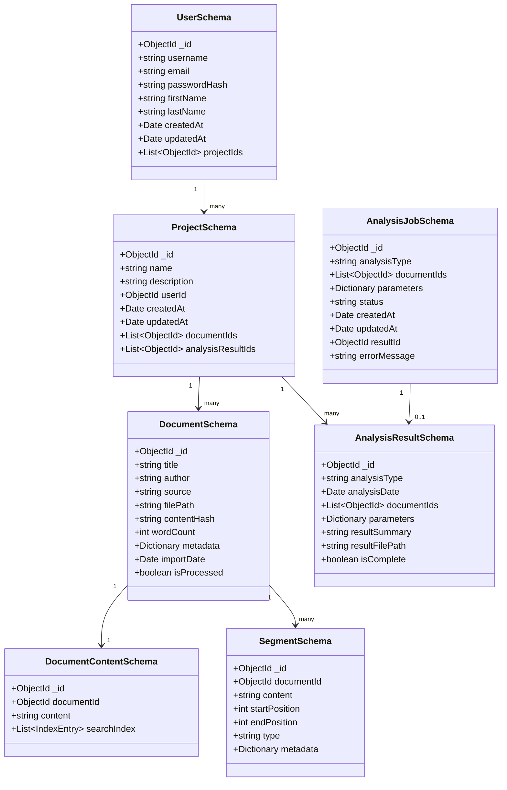
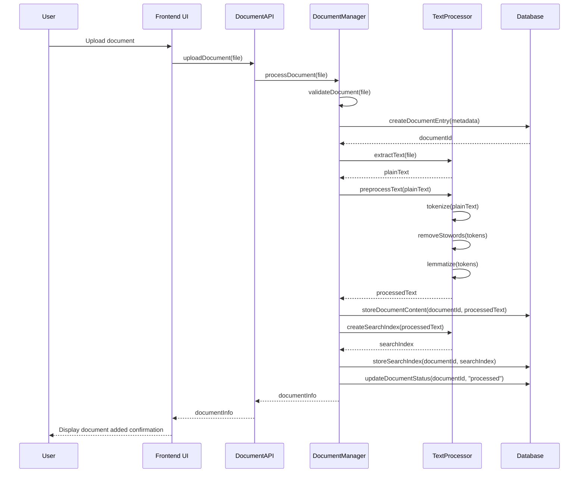
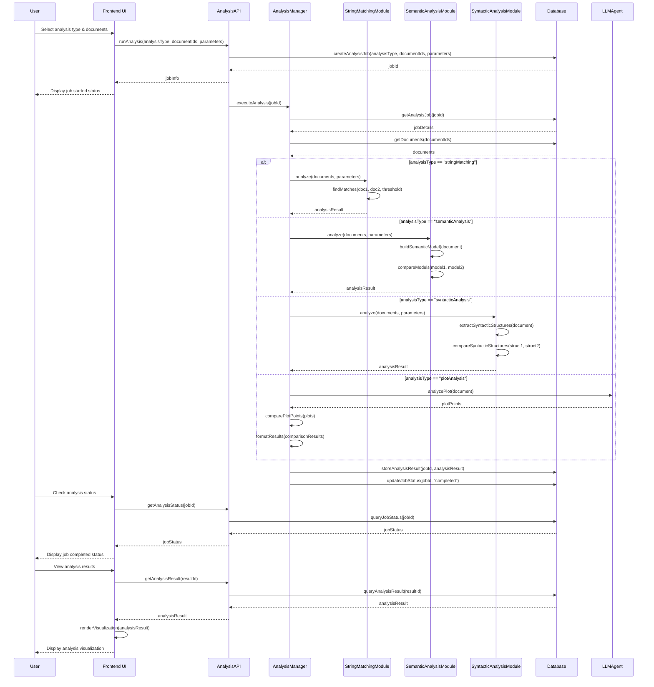
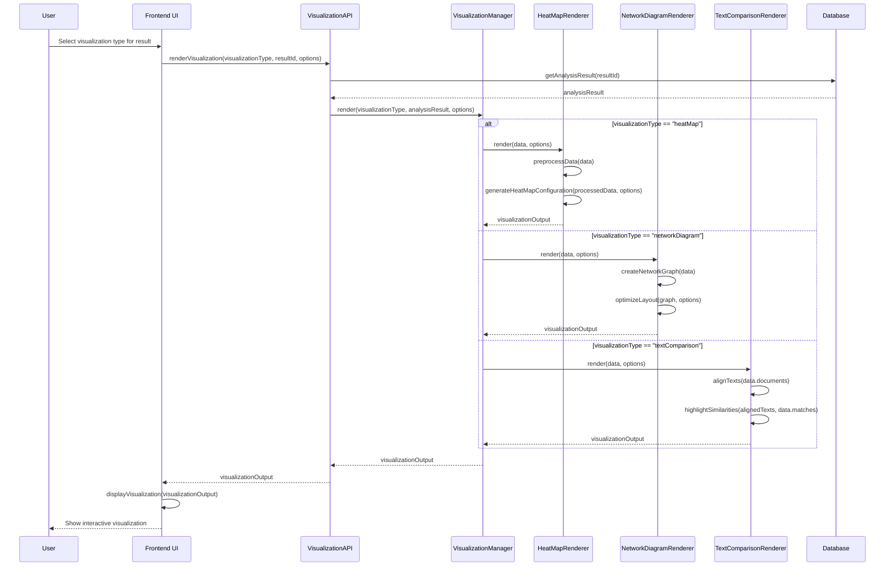
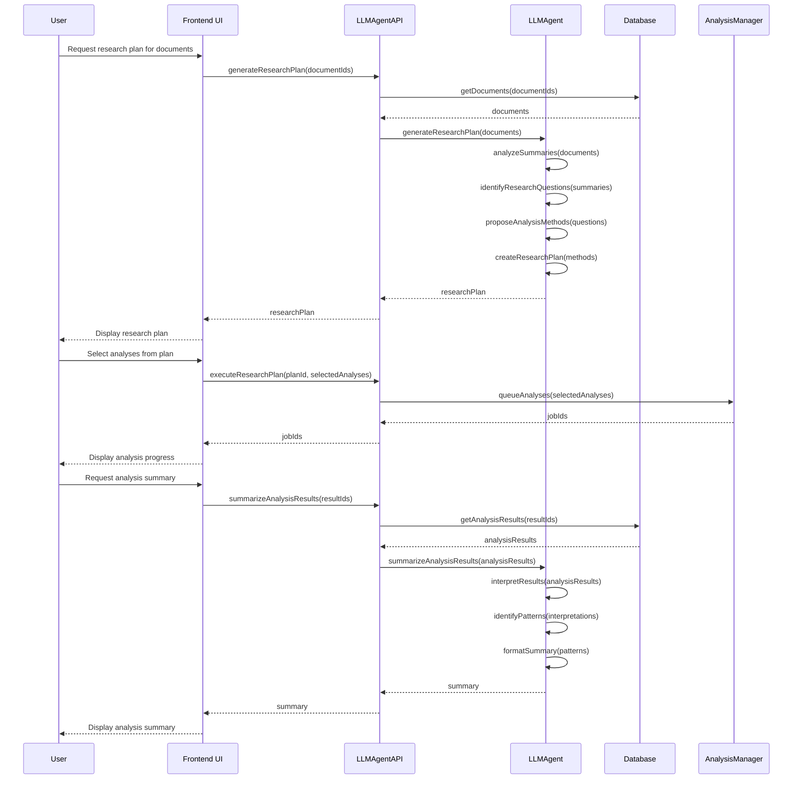

# Palimpsest System Design

## Implementation approach

Based on the requirements outlined in the PRD, we'll implement Palimpsest as a comprehensive text analysis platform capable of comparing large documents across multiple conceptual dimensions. The system will be built using a combination of proven technologies and libraries to deliver powerful analysis capabilities with an intuitive interface.

### Key Implementation Decisions

1. **Architecture**: We'll use a client-server architecture with:
   - A React/JavaScript/Tailwind CSS frontend for intuitive UI and visualizations
   - A Python backend for powerful text processing capabilities
   - A REST API to connect the frontend and backend

2. **Framework Selection**:
   - Frontend: React.js with TypeScript for type safety and Tailwind CSS for styling
   - Backend: FastAPI for high-performance Python API development
   - Database: MongoDB for flexible document storage

3. **Text Processing Libraries**:
   - spaCy for efficient NLP operations (tokenization, parsing, named entity recognition)
   - NLTK for academic NLP tasks and traditional text processing
   - Gensim for semantic analysis and topic modeling
   - PyTorch for custom NLP models and deep learning capabilities
   - Hugging Face Transformers for pre-trained models and LLM integration

4. **Visualization Libraries**:
   - D3.js for interactive, customizable visualizations
   - plotly.js for scientific visualizations
   - react-force-graph for network diagrams

5. **Performance Optimizations**:
   - Multi-threading via Python's concurrent.futures
   - Caching using Redis
   - Incremental processing for large documents
   - Modular processing pipeline for parallel execution
   - Efficient storage of analysis results

6. **Genomic Analysis Influence**:
   - Borrowing visualization techniques from genomic comparison tools (like Circos plots for showing relationships)
   - Implementing modified sequence alignment algorithms (similar to BLAST) for text comparison
   - Using hierarchical clustering approaches similar to phylogenetic tree construction

7. **Cross-Platform Strategy**:
   - Desktop app using Electron for Windows/macOS/Linux
   - Browser-based version using responsive web design principles
   - Shared core codebase between versions

### Difficult Points & Solutions

1. **Processing Very Large Documents**:
   - Challenge: Analyzing documents of 1M+ words efficiently
   - Solution: Incremental processing, text segmentation, optimized algorithms, and caching of intermediate results

2. **Complex Multi-dimensional Analysis**:
   - Challenge: Integrating multiple types of analyses coherently
   - Solution: Modular analysis pipeline with standardized inputs/outputs between stages

3. **LLM Integration**:
   - Challenge: Cost-effective and efficient use of LLM capabilities
   - Solution: Strategic LLM usage only for specialized tasks with caching of results

4. **Interactive Visualization of Large Datasets**:
   - Challenge: Rendering complex relationships without performance issues
   - Solution: Data aggregation, progressive loading, and WebGL-based rendering for larger datasets

5. **Cross-platform Compatibility**:
   - Challenge: Consistent experience across platforms
   - Solution: Electron for desktop versions with responsive web design for browser version

## Data structures and interfaces

The system's data structures are designed to efficiently manage document content, analysis results, and visualization data.

### Core Data Structures

```mermaid
classDiagram
    class TextDocument {
        +string documentId
        +string title
        +string author
        +string source
        +string content
        +string filePath
        +int wordCount
        +Dictionary~string, any~ metadata
        +DateTime importDate
        +__init__(title, content, source)
        +loadFromFile(filePath)
        +loadFromURL(url)
        +split(strategy) List~TextSegment~
        +getMetadata() Dictionary
    }
    
    class TextSegment {
        +string segmentId
        +string documentId
        +string content
        +int startPosition
        +int endPosition
        +SegmentType type
        +__init__(documentId, content, startPos, endPos, type)
        +getTokens() List~Token~
        +getSentences() List~Sentence~
    }
    
    class TextCorpus {
        +string corpusId
        +string name
        +List~TextDocument~ documents
        +Dictionary~string, any~ metadata
        +__init__(name)
        +addDocument(document)
        +removeDocument(documentId)
        +getDocument(documentId) TextDocument
        +getDocuments() List~TextDocument~
    }
    
    class AnalysisResult {
        +string resultId
        +string analysisType
        +DateTime analysisDate
        +List~string~ documentIds
        +Dictionary~string, any~ parameters
        +Dictionary~string, any~ results
        +__init__(analysisType, documentIds, parameters)
        +addResult(key, value)
        +getResult(key) any
        +serialize() string
    }
    
    class AnalysisManager {
        +Dictionary~string, AnalysisModule~ modules
        +__init__()
        +registerModule(name, module)
        +runAnalysis(analysisType, documents, parameters) AnalysisResult
        +getAvailableAnalyses() List~string~
    }
    
    class AnalysisModule {
        <<interface>>
        +string moduleName
        +string moduleDescription
        +analyze(documents, parameters) AnalysisResult
        +getDefaultParameters() Dictionary
    }
    
    class StringMatchingModule {
        +analyze(documents, parameters) AnalysisResult
        +getDefaultParameters() Dictionary
        +findMatches(doc1, doc2, threshold) List~Match~
    }
    
    class SemanticAnalysisModule {
        +analyze(documents, parameters) AnalysisResult
        +getDefaultParameters() Dictionary
        +buildSemanticModel(document) Model
        +compareModels(model1, model2) List~SemanticSimilarity~
    }
    
    class SyntacticAnalysisModule {
        +analyze(documents, parameters) AnalysisResult
        +getDefaultParameters() Dictionary
        +extractSyntacticStructures(document) List~SyntacticStructure~
        +compareSyntacticStructures(struct1, struct2) float
    }
    
    class StructuralAnalysisModule {
        +analyze(documents, parameters) AnalysisResult
        +getDefaultParameters() Dictionary
        +extractStructuralElements(document) StructuralMap
        +compareStructures(struct1, struct2) List~StructuralSimilarity~
    }
    
    class PlotAnalysisModule {
        +analyze(documents, parameters) AnalysisResult
        +getDefaultParameters() Dictionary
        +identifyPlotPoints(document) List~PlotPoint~
        +comparePlotFlow(plot1, plot2) float
    }
    
    class ThemeAnalysisModule {
        +analyze(documents, parameters) AnalysisResult
        +getDefaultParameters() Dictionary
        +extractThemes(document) List~Theme~
        +compareThemes(themes1, themes2) List~ThemeSimilarity~
    }
    
    class SynopticTextGenerator {
        +analyze(documents, parameters) AnalysisResult
        +getDefaultParameters() Dictionary
        +generateUnifiedText(documents) string
        +generateAnnotations(documents, unifiedText) List~Annotation~
    }
    
    class LLMAgent {
        +string modelName
        +string modelProvider
        +__init__(modelName, provider)
        +researchDocument(document) ResearchResult
        +generateResearchPlan(documents) ResearchPlan
        +analyzePlot(document) List~PlotPoint~
        +identifyTextualPatterns(document) List~Pattern~
        +summarizeAnalysisResults(results) Summary
    }
    
    class VisualizationManager {
        +Dictionary~string, VisualizationRenderer~ renderers
        +__init__()
        +registerRenderer(name, renderer)
        +render(visualizationType, data, options) VisualizationOutput
        +getAvailableVisualizations() List~string~
    }
    
    class VisualizationRenderer {
        <<interface>>
        +string rendererName
        +string rendererDescription
        +render(data, options) VisualizationOutput
        +getDefaultOptions() Dictionary
    }
    
    class ProjectManager {
        +List~Project~ projects
        +__init__()
        +createProject(name) Project
        +loadProject(projectId) Project
        +saveProject(project)
        +deleteProject(projectId)
        +listProjects() List~Project~
    }
    
    class Project {
        +string projectId
        +string name
        +TextCorpus corpus
        +List~AnalysisResult~ analysisResults
        +DateTime creationDate
        +DateTime lastModified
        +__init__(name)
        +addDocument(document)
        +addAnalysisResult(result)
        +getAnalysisResults() List~AnalysisResult~
    }
    
    TextDocument "1" --> "many" TextSegment
    TextCorpus "1" --> "many" TextDocument
    AnalysisManager "1" --> "many" AnalysisModule
    AnalysisModule <|.. StringMatchingModule
    AnalysisModule <|.. SemanticAnalysisModule
    AnalysisModule <|.. SyntacticAnalysisModule
    AnalysisModule <|.. StructuralAnalysisModule
    AnalysisModule <|.. PlotAnalysisModule
    AnalysisModule <|.. ThemeAnalysisModule
    AnalysisModule <|.. SynopticTextGenerator
    VisualizationManager "1" --> "many" VisualizationRenderer
    ProjectManager "1" --> "many" Project
    Project "1" --> "1" TextCorpus
    Project "1" --> "many" AnalysisResult
```

### API Interfaces

```mermaid
classDiagram
    class DocumentAPI {
        +uploadDocument(file) DocumentInfo
        +importFromURL(url) DocumentInfo
        +getDocument(documentId) Document
        +listDocuments() List~DocumentInfo~
        +deleteDocument(documentId)
        +updateDocumentMetadata(documentId, metadata)
    }
    
    class AnalysisAPI {
        +getAvailableAnalyses() List~AnalysisInfo~
        +runAnalysis(analysisType, documentIds, parameters) JobInfo
        +getAnalysisStatus(jobId) JobStatus
        +getAnalysisResult(resultId) AnalysisResult
        +listAnalysisResults(documentId) List~AnalysisResultInfo~
        +deleteAnalysisResult(resultId)
    }
    
    class VisualizationAPI {
        +getAvailableVisualizations() List~VisualizationInfo~
        +renderVisualization(visualizationType, resultId, options) VisualizationOutput
        +getVisualizationData(resultId, format) VisualizationData
    }
    
    class ProjectAPI {
        +createProject(name) ProjectInfo
        +getProject(projectId) Project
        +updateProject(projectId, details) ProjectInfo
        +deleteProject(projectId)
        +listProjects() List~ProjectInfo~
        +addDocumentToProject(projectId, documentId)
        +removeDocumentFromProject(projectId, documentId)
    }
    
    class LLMAgentAPI {
        +generateResearchPlan(documentIds) ResearchPlan
        +analyzeDocument(documentId, analysisType) AnalysisResult
        +summarizeAnalysisResults(resultIds) Summary
    }
    
    class UserAPI {
        +register(userDetails) UserInfo
        +login(credentials) AuthToken
        +logout()
        +getUserProfile() UserProfile
        +updateUserProfile(profile) UserProfile
        +changePassword(oldPassword, newPassword)
    }
```

### Database Schema

## Program call flow

The following sequence diagrams illustrate the key program flows within Palimpsest.

### Document Import Flow

### Analysis Execution Flow

### Visualization Rendering Flow

### LLM Agent Integration Flow

## Anything UNCLEAR

1. **Resource Requirements**: The specific hardware and memory requirements needed for analyzing extremely large documents (1M+ words) will need to be determined through benchmarking and optimization during early development phases.

2. **LLM Selection and Integration**: The PRD doesn't specify which LLM models should be used. A detailed evaluation of various LLM options (local vs. cloud-based, open source vs. proprietary) will be needed to determine the best approach based on cost, performance, and privacy considerations.

3. **Performance Thresholds**: While the PRD mentions "reasonable time constraints" (<30 minutes for processing 1M word documents), more specific performance benchmarks may need to be established for different analysis types and document sizes.

4. **Authentication and User Management**: The PRD doesn't provide specific requirements about user authentication and access control. This architecture assumes basic user management will be needed but could be expanded based on clarification.

5. **Genome Analysis Techniques Integration**: More research is needed to determine exactly which genomic analysis techniques would be most valuable to adapt for text analysis purposes. This would benefit from consultation with experts in both genomic analysis and computational linguistics.

6. **External API Integration**: The specific external APIs for accessing public text repositories (such as Project Gutenberg) will need to be identified and integration protocols established.

7. **Browser "Lite" Version Limitations**: Clear boundaries need to be established regarding which features will be available in the browser version versus the full desktop version, based on browser computational limitations.